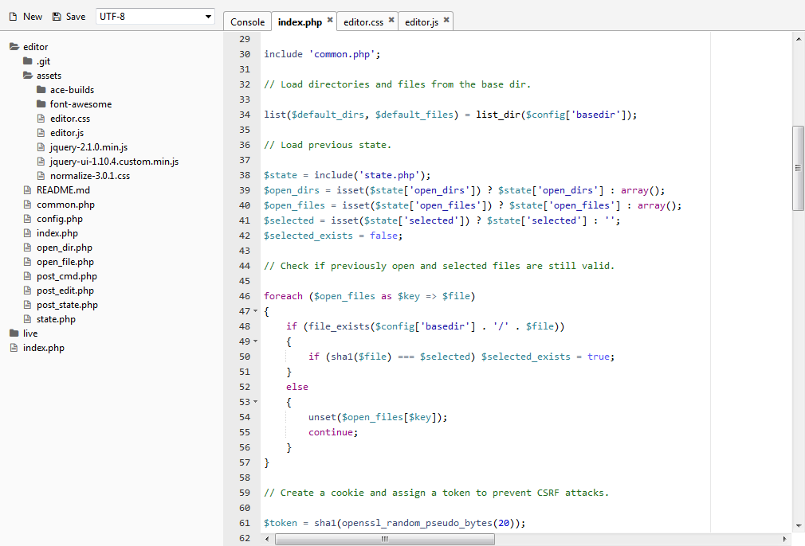

Introduction
------------

QADE is a quick and dirty editor for browsing files and editing them _right on the server_.
It is written in PHP and JavaScript, and uses the excellent [ACE Editor](http://ace.c9.io/) for the editing component.

License
-------

QADE is free software, released under the permissive MIT license.
Other components that are distributed with QADE, such as jQuery, ACE Editor, and Font Awesome, may have their own licenses.

Features
--------

- Filesystem browser in the sidebar
- Multiple tabs
- Open files in any encoding and save them in any other encoding (UTF-8 by default)
- A rudimentary virtual console for executing shell commands on the server

Screenshot
----------

Getting Started
---------------

1. Download QADE to a location of your choice, inside the document root of your web server.
2. Open `config.php` and specify the directory that you wish to see in the sidebar.
3. Make `state.php` writable by the PHP process.
4. Make writable any other files that you wish to edit.
5. Open QADE in a modern web browser such as Firefox and Chrome.

Security
--------

Needless to say, it is extremely dangerous to edit your live website right on the server.
In fact, you probably shouldn't do it unless you know exactly what you're doing.

QADE provides basic protections against XSS and CSRF attacks, but that's about it.
Any part of your server that is accessible by the PHP process can be accessed by QADE
-- yes, that includes `/etc/passwd`, although nobody actually stores passwords in that file anymore --
and if the files are writable, QADE can easily modify them, too.
Moreover, QADE's console allows anyone to execute arbitrary commands on the server,
limited only by the privileges of the PHP process.

QADE provides no mechanism for access control. There is no login, no password. This is intentional.
If you use QADE anywhere other than `localhost`, it is your responsibility to use:

- Strong encryption for your connection (TLS 1.2), and
- HTTP basic or digest authentication for the website where QADE is installed, and
- If possible, access control by IP address, user agent string, or anything else that helps distinguish _you_ from everybody else.

If you install QADE on your server and you get hacked, don't blame me. **You have been warned**.

Limitations
-----------

QADE currently cannot create new files, rename files, or save files as another name.
Please use the console for such tasks.
(If you don't know how to use simple shell commands, QADE is probably not for you.)

